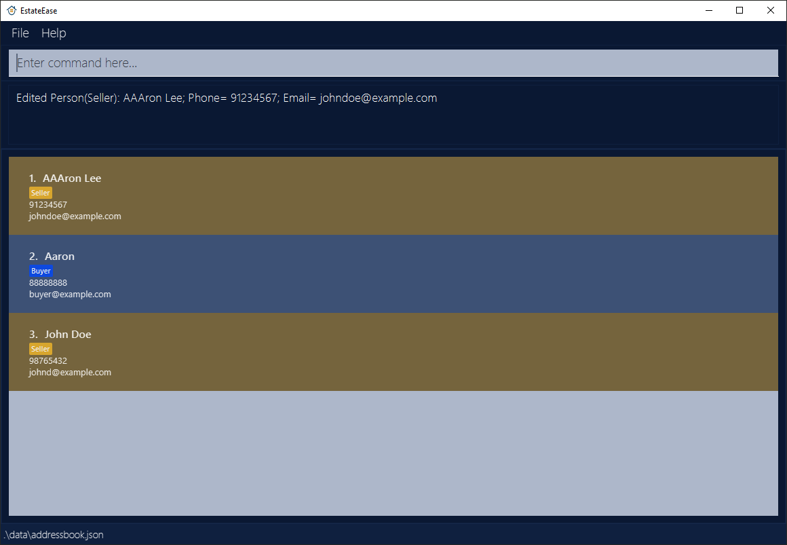
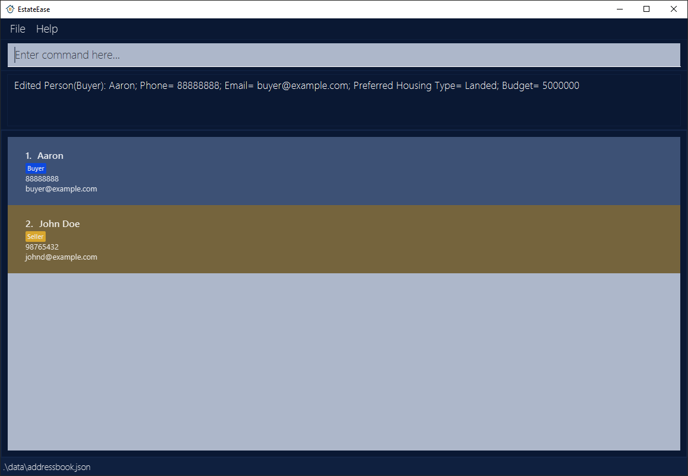

# EstateEase User Guide

EstateEase is a **desktop app for managing contacts, optimized for use via a  Line Interface** (CLI) while still having the benefits of a Graphical User Interface (GUI). If you can type fast, Estate Ease can get your contact management tasks done faster than traditional GUI apps.

<!-- * Table of Contents -->
<page-nav-print />

--------------------------------------------------------------------------------------------------------------------

## Quick start

1. Ensure you have Java `11` or above installed in your Computer.

1. Download the latest `EstateEase.jar` from [here](https://github.com/AY2324S2-CS2103-F09-1/tp/releases).

1. Copy the file to the folder you want to use as the _home folder_ for your AddressBook.

1. Open a command terminal, `cd` into the folder you put the jar file in, and use the `java -jar EstateEase.jar` command to run the application. 
   A GUI similar to the below should appear in a few seconds. Note how the app contains some sample data. 
   

1. Type the command in the command box and press Enter to execute it. e.g. typing **`help`** and pressing Enter will open the help window. 
   Some example commands you can try:

   * `list` : Lists all contacts.

   * `addSeller n/John Doe p/98765432 e/johnd@example.com type/HDB street/Clementi Ave 2 blk/311 level/02 unitNo/25 postal/578578 price/10000 t/friends t/owesMoney` : Adds a seller named `John Doe` to the Address Book.

   * `delete 3` : Deletes the 3rd contact shown in the current list.
   
   * `matchBuyer Alice Lim` : Display Seller details with House that match the Budget and HousingType of the Buyer named `Alice Lim` in the Address Book.

   * `clear` : Deletes all contacts.

   * `exit` : Exits the app.

1. Refer to the [Features](#features) below for details of each command.

--------------------------------------------------------------------------------------------------------------------

## Features

<box type="info" seamless>

**Notes about the command format:** 

* Words in `UPPER_CASE` are the parameters to be supplied by the user. 
  e.g. in `addBuyer n/NAME`, `NAME` is a parameter which can be used as `addBuyer n/John Doe`.

* Items in square brackets are optional. 
  e.g `n/NAME [t/TAG]` can be used as `n/John Doe t/friend` or as `n/John Doe`.

* Items with `…`​ after them can be used multiple times including zero times. 
  e.g. `[t/TAG]…​` can be used as ` ` (i.e. 0 times), `t/friend`, `t/friend t/family` etc.

* Parameters can be in any order. 
  e.g. if the command specifies `n/NAME p/PHONE_NUMBER`, `p/PHONE_NUMBER n/NAME` is also acceptable.

* Extraneous parameters for commands that do not take in parameters (such as `help`, `list`, `exit` and `clear`) will be ignored. 
  e.g. if the command specifies `help 123`, it will be interpreted as `help`.

* If you are using a PDF version of this document, be careful when copying and pasting commands that span multiple lines as space characters surrounding line-breaks may be omitted when copied over to the application.
</box>

### Viewing help : `help`

Shows a message explaning how to access the help page.

Format: `help`

### Adding a seller: `addSeller`

Adds a `Seller` to the address book.

Format: `addSeller [n/NAME] [p/PHONE_NUMBER] [e/EMAIL] [street/STREET]  [blk/BLOCK] [level/LEVEL] [unitNo/UNIT_NUMBER] [postal/POSTAL_CODE] [price/HOUSE_PRICE]`

<box type="tip" seamless>

**Note:** 
- Adding a `Seller` will add a `House` to his/her list of houses, so that `Seller` and `Buyer` can be matched immediately if their preference matched.
- A `Seller` cannot have the same name as a `Buyer`, because a `Seller` cannot be a `Buyer`, they must be unique.
</box>

Examples:
* `addSeller n/John Doe p/98765432 e/johnd@example.com type/HDB street/Clementi Ave 2 blk/311 level/02 unitNo/25 postal/578578 price/10000`
* `addSeller n/John Doe p/98765432 e/johnd@example.com type/Condominium street/Clementi Ave 2 blk/N/A level/02 unitNo/25 postal/578578 price/10000`
* `addSeller n/John Doe p/98765432 e/johnd@example.com type/Condominium street/Clementi Ave 2 level/02 unitNo/25 postal/578578 price/10000`
* `addSeller n/John Doe p/98765432 e/johnd@example.com type/Landed street/Clementi Ave 2 unitNo/25 postal/578578 price/10000`

### Editing seller details : `editSeller`

Edits an existing `Seller` in EstateEase.

Format: `editSeller INDEX [n/NAME] [p/PHONE] [e/EMAIL]`

<box type="tip" seamless>

**Note:**
* Edits the seller at the specified `INDEX`. The index refers to the index number shown in the displayed person list.
  The index **must be a positive integer** 1, 2, 3, …
* The specified `INDEX` must be pointing to a `Seller` and not a `Buyer`.
* At least one of the optional fields must be provided.
* Existing values will be updated to the input values.

</box>

Examples:
*  `editSeller 1 p/91234567 e/johndoe@example.com` edits the phone number and email address of the 1st person,
   that is also a seller, to be `91234567` and `johndoe@example.com` respectively.

### Editing buyer details : `editBuyer`

Edits an existing `Buyer` in EstateEase.

Format: `editBuyer INDEX [n/NAME] [p/PHONE] [e/EMAIL] [type/HOUSING_TYPE] [budget/BUDGET]`

<box type="tip" seamless>

**Note:**
* The constraints are very similar to `editSeller` command, except the specified `INDEX` must be pointing to a `Buyer`
  and not a `Seller`.

</box>

Examples:
* `editBuyer 1 p/88888888 e/buyer@example.com type/Landed budget/5000000` edits the phone number, email,
  preferred housing type, and budget of the 1st person, that is also a buyer, to be `88888888`, `buyer@example.com`,
  `Landed`, and `5000000` respectively.

### Adding a house: `addHouse`

Adds a house to a specific seller.

Format: `addHouse [n/NAME] [p/PHONE_NUMBER] [blk/BLOCK] [level/LEVEL] [unitNo/UNIT_NUMBER] [postal/POSTAL_CODE] [price/HOUSE_PRICE]`

<box type="tip" seamless>

**Tip:** A Hdb must have blk and level in the command. A condominium must have level in the command. A landed house must NOT have blk or level.

**Note:** Even if the house type is different, if all other details (except Price) are the same, they are considered as the same house.
</box>

Examples:
* `addHouse n/John Doe type/HDB street/Clementi Ave 2 blk/311 level/02 unitNo/25 postal/578578 price/10000`
* `addHouse n/John Doe type/Condominium street/Clementi Ave 2 blk/N/A level/02 unitNo/25 postal/578578 price/10000`
* `addHouse n/John Doe type/Condominium street/Clementi Ave 2 level/02 unitNo/25 postal/578578 price/10000`
* `addHouse n/John Doe type/Landed street/Clementi Ave 2 unitNo/25 postal/578578 price/10000`

### Deleting a house: `deleteHouse`

Deletes a house from a specific seller.

Format: `deleteHouse [n/NAME] [street/STREET]  [blk/BLOCK] [level/LEVEL] [unitNo/UNIT_NUMBER] [postal/POSTAL_CODE] [price/HOUSE_PRICE]`

<box type="tip" seamless>

**Tip:** A Hdb must have blk and level in the command. A condominium must have level in the command. A landed house must NOT have blk or level.

**Note:** A seller with one house can have his house deleted. The seller would have no houses to his name then but would still exist.
</box>

Examples:
* `deleteHouse n/John Doe type/HDB street/Clementi Ave 2 blk/311 level/02 unitNo/25 postal/578578 price/10000`
* `deleteHouse n/John Doe type/Condominium street/Clementi Ave 2 blk/N/A level/02 unitNo/25 postal/578578 price/10000`
* `deleteHouse n/John Doe type/Condominium street/Clementi Ave 2 level/02 unitNo/25 postal/578578 price/10000`
* `deleteHouse n/John Doe type/Landed street/Clementi Ave 2 unitNo/25 postal/578578 price/10000`

### Matching Sellers to a Buyer: `matchBuyer`

Shows the list of sellers and their houses that match the budget and preferred housing type of a specified buyer.

Format: `matchBuyer FULL_NAME`

<box type="tip" seamless>

**Tip:** A full name of the buyer must be used in the command.

</box>

Examples:
* `matchBuyer Alice Lim`

### Listing all persons : `list`

Shows a list of all persons in the address book.

Format: `list`

### Locating persons by name: `find`

Finds persons whose names contain any of the given keywords.

Format: `find KEYWORD [MORE_KEYWORDS]`

* The search is case-insensitive. e.g `hans` will match `Hans`
* The order of the keywords does not matter. e.g. `Hans Bo` will match `Bo Hans`
* Only the name is searched.
* Only full words will be matched e.g. `Han` will not match `Hans`
* Persons matching at least one keyword will be returned (i.e. `OR` search).
  e.g. `Hans Bo` will return `Hans Gruber`, `Bo Yang`

Examples:
* `find John` returns `john` and `John Doe`
* `find alex david` returns `Alex Yeoh`, `David Li` 
  

### Deleting a person : `delete`

Deletes the specified person from the address book.

Format: `delete INDEX`

* Deletes the person at the specified `INDEX`.
* The index refers to the index number shown in the displayed person list.
* The index **must be a positive integer** 1, 2, 3, …​

Examples:
* `list` followed by `delete 2` deletes the 2nd person in the address book.
* `find Betsy` followed by `delete 1` deletes the 1st person in the results of the `find` command.

### Clearing all entries : `clear`

Clears all entries from the address book.

Format: `clear`

### Exiting the program : `exit`

Exits the program.

Format: `exit`

### Saving the data

AddressBook data are saved in the hard disk automatically after any command that changes the data. There is no need to save manually.

### Editing the data file

AddressBook data are saved automatically as a JSON file `[JAR file location]/data/addressbook.json`. Advanced users are welcome to update data directly by editing that data file.

<box type="warning" seamless>

**Caution:**
If your changes to the data file makes its format invalid, AddressBook will discard all data and start with an empty data file at the next run.  Hence, it is recommended to take a backup of the file before editing it. 
Furthermore, certain edits can cause the AddressBook to behave in unexpected ways (e.g., if a value entered is outside the acceptable range). Therefore, edit the data file only if you are confident that you can update it correctly.
</box>

### Archiving data files `[coming in v2.0]`

_Details coming soon ..._

--------------------------------------------------------------------------------------------------------------------

## FAQ

**Q**: How do I transfer my data to another Computer? 
**A**: Install the app in the other computer and overwrite the empty data file it creates with the file that contains the data of your previous AddressBook home folder.

--------------------------------------------------------------------------------------------------------------------

## Known issues

1. **When using multiple screens**, if you move the application to a secondary screen, and later switch to using only the primary screen, the GUI will open off-screen. The remedy is to delete the `preferences.json` file created by the application before running the application again.

--------------------------------------------------------------------------------------------------------------------

## Command summary

Action     | Format, Examples
-----------|----------------------------------------------------------------------------------------------------------------------------------------------------------------------
**Add Seller**    | `addSeller [n/NAME] [p/PHONE_NUMBER] [e/EMAIL] [street/STREET]  [blk/BLOCK] [level/LEVEL] [unitNo/UNIT_NUMBER] [postal/POSTAL_CODE] [price/HOUSE_PRICE] [t/TAG]…​`  e.g.,`addSeller n/John Doe p/98765432 e/johnd@example.com type/HDB street/Clementi Ave 2 blk/311 level/02 unitNo/25 postal/578578 price/10000 t/friends t/owesMoney`
**Clear**         | `clear`
**Delete**        | `delete INDEX`  e.g., `delete 3`
**Edit Seller**   | `editSeller INDEX [n/NAME] [p/PHONE_NUMBER] [e/EMAIL] [a/ADDRESS]`  e.g.,`editSeller 1 n/James Lee e/jameslee@example.com`
**Edit Buyer**    | `editBuyer INDEX [n/NAME] [p/PHONE] [e/EMAIL] [type/HOUSING_TYPE] [budget/BUDGET]`  e.g.,`editBuyer 1 p/88888888 e/buyer@example.com type/Landed budget/5000000`
**Find**          | `find KEYWORD [MORE_KEYWORDS]`  e.g., `find James Jake`
**List**          | `list`
**Help**          | `help`
