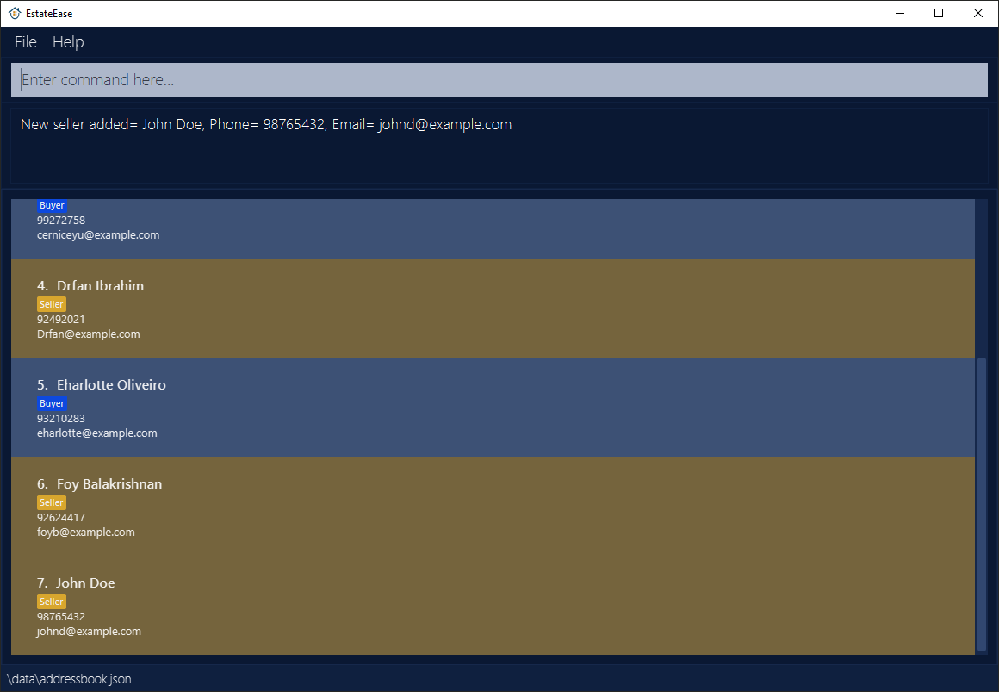
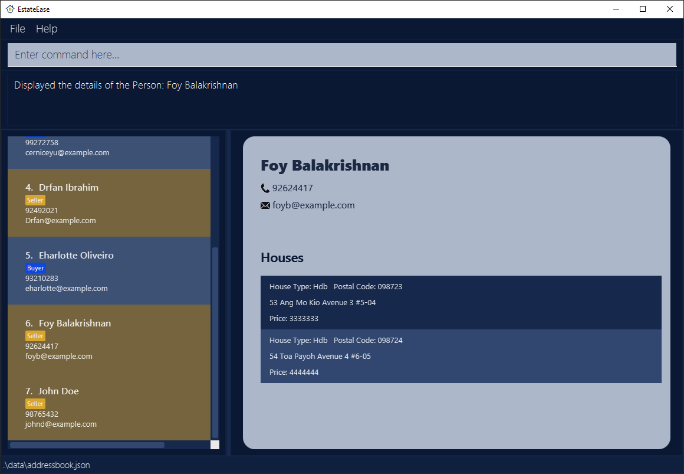
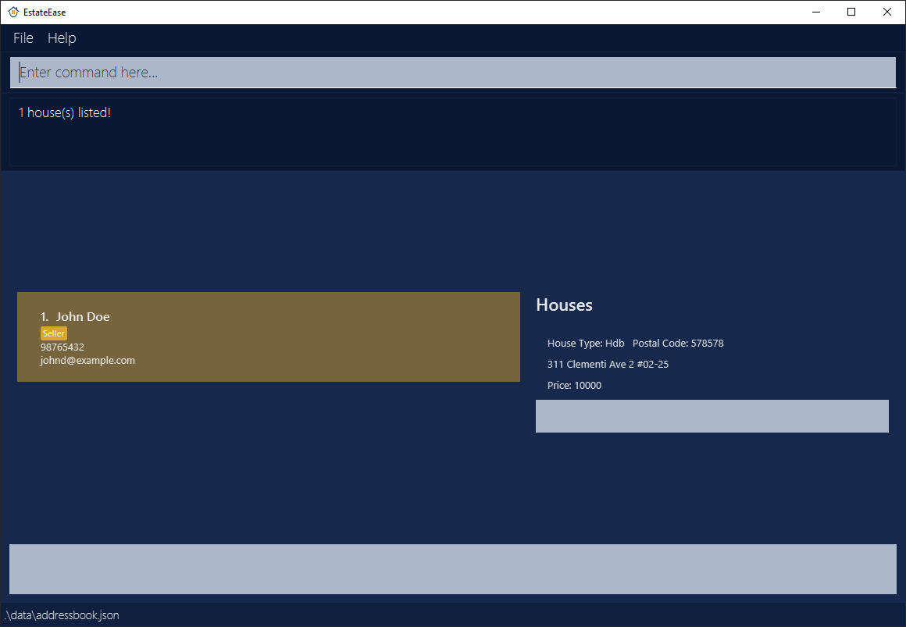
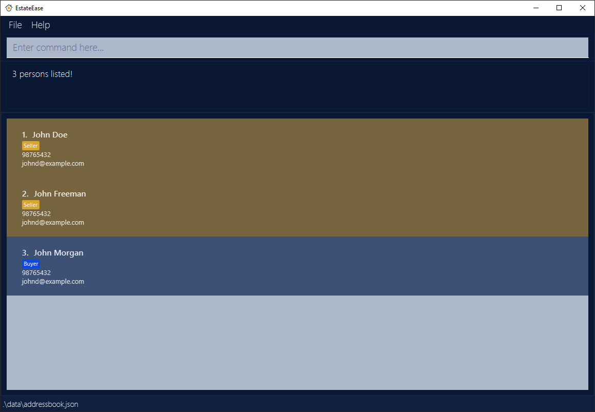

# EstateEase User Guide

EstateEase is an **advanced desktop application designed to streamline residential property management for real estate listing agents in Singapore.** Engineered for efficiency, it combines the precision of a Command Line Interface (CLI) with the versatility of a Graphical User Interface (GUI). For those proficient in typing, EstateEase enables quicker and more effective residential property management than conventional GUI-based applications.

### Key Features:
* With intuitive tools for listing contacts and houses, the app is tailored for efficiency.
* Agents can quickly access contacts and houses, allowing for quicker transactions to take place.
* Agents can match buyer with houses according to their preferences.

### Example Usages:
* Allows real estate agents to add and delete contact information.
* Allows real estate agents to load and save the list using JSON file.
* Allows real estate agents to match buyers and houses.

## Acknowledgements
This project is based on the AddressBook-Level3 project created by the
[SE-EDU initiative](https://se-education.org).

<!-- * Table of Contents -->
<page-nav-print />

--------------------------------------------------------------------------------------------------------------------
<div style="page-break-after: always;"></div>

## Quick start

1. Ensure you have Java `11` or above installed in your Computer.

1. Download the latest `EstateEase.jar` from [here](https://github.com/AY2324S2-CS2103-F09-1/tp/releases).

1. Copy the file to the folder you want to use as the _home folder_ for your EstateEase.

1. Open a command terminal, `cd` into the folder you put the jar file in, and use the `java -jar EstateEase.jar` command to run the application.<br>
   A GUI similar to the below should appear in a few seconds. Note how the app contains some sample data.<br>
   

1. Type the command in the command box and press Enter to execute it. e.g. typing **`help`** and pressing Enter will open the help window.<br>
   Some example commands you can try:

   * `list` : Lists all contacts.

   * `addSeller n/John Doe p/98765432 e/johnd@example.com type/Hdb street/Clementi Ave 2 blk/311 level/02 unitNo/25 postal/578578 price/999999999`:<br> Adds a `Seller` named `John Doe` with a `House` to EstateEase.

   * `delete 3` : Deletes the 3rd contact shown in the current list.

   * `matchBuyer Alex Yeoh
   ` : Display `Seller` details with `House` that match the `Budget` and `HousingType` of the `Buyer` named `Alex Yeoh
   ` in EstateEase.

   * `clear` : Deletes all contacts.

   * `exit` : Exits the app.

1. Refer to the [Features](#features) below for details of each command.

--------------------------------------------------------------------------------------------------------------------
<div style="page-break-after: always;"></div>

## Variable Constraints
- `BUDGET` must be a positive number with at most 17 digits, including any decimal points, and less than 1 trillion.
- `PRICE` must be a positive number with at most 17 digits, including any decimal points, and less than 1 trillion.
- `INDEX` must be positive with a maximum value equal to the number of people stored in the app or 2147483647, whichever is smaller.
- `PHONE` must be at least 3 digits long and at most 15 digits long to account for international constraints. Phone numbers entered should be no shorter than 3 characters and no longer than 15 characters.
--------------------------------------------------------------------------------------------------------------------

## Features

<box type="info" seamless>

**Notes about the command format:**<br>

* Words in `UPPER_CASE` are the parameters to be supplied by the user.<br>
  e.g. in `addBuyer n/NAME`, `NAME` is a parameter which can be used as `addBuyer n/John Doe`.

* Items in square brackets are optional.<br>
  e.g `n/NAME [e/EMAIL]` can be used as `n/John Doe e/johnny@doe.com` or as `n/John Doe`.

* Parameters can be in any order.<br>
  e.g. if the command specifies `n/NAME p/PHONE`, `p/PHONE n/NAME` is also acceptable.

* Extraneous parameters for commands that do not take in parameters (such as `help`, `list`, `exit` and `clear`) will be ignored.<br>
  e.g. if the command specifies `help 123`, it will be interpreted as `help`.

* If you are using a PDF version of this document, be careful when copying and pasting commands that span multiple lines as space characters surrounding line-breaks may be omitted when copied over to the application.
</box>

### Viewing help : `help`

Shows a message explaning how to access the help page.


Format: `help`

<div style="page-break-after: always;"></div>

### Adding a buyer: `addBuyer`

Adds a `Buyer` to EstateEase.

Format: `addBuyer n/NAME p/PHONE e/EMAIL budget/BUDGET type/PREFERRED_HOUSING_TYPE`

<box type="tip" seamless>

**Note:**
- `BUDGET` and `PREFERRED_HOUSING_TYPE` are the housing requirement preferences for every `Buyer`, so that `Buyer` and `Seller` can be matched immediately if their preference matched.
- The `BUDGET` value should not exceed $1 trillion.
- A `Buyer` cannot have the same name as a `Seller`, because a `Buyer` cannot be a `Seller`, they must be unique.
  </box>

Examples:
* `addBuyer n/James p/98765432 e/james@gmail.com budget/20000 type/Hdb`
* `addBuyer n/James p/98765432 e/james@gmail.com budget/20000 type/Condominium`
* `addBuyer n/James p/98765432 e/james@gmail.com budget/20000 type/Landed`

<div style="page-break-after: always;"></div>

### Adding a seller: `addSeller`

Adds a `Seller` to EstateEase.

Format: `addSeller n/NAME p/PHONE e/EMAIL type/HOUSING_TYPE street/STREET [blk/BLOCK] [level/LEVEL] unitNo/UNIT_NUMBER postal/POSTAL_CODE price/HOUSE_PRICE`

<box type="tip" seamless>

**Note:**
- Adding a `Seller` will add a `House` to his/her list of houses, so that `Seller` and `Buyer` can be matched immediately if their preference matched.
- A `Seller` cannot have the same name as a `Buyer`, because a `Seller` cannot be a `Buyer`, they must be unique.
- The necessity of fields `Block` and `Level` depends on the `Housing Type`. If the `Housing Type` is a `Condominium`, including a `Block` is optional but a `Level` is compulsory. If the `Housing Type` is `Landed`, `Block` and `Level` must not exist. For `Hdb`, `Block` and `Level` are compulsory.
</box>

##### Successful Execution

**Example 1**

> **Case**: Add seller with name, phone, email, housing type of `Hdb`, street, block, level, unit number, postal code and housing price.
>
> **Input**: `addSeller n/John Doe p/98765432 e/johnd@example.com type/Hdb street/Clementi Ave 2 blk/311 level/02 unitNo/25 postal/578578 price/999999999`
>
> **Output**:
> ```
> New seller added= John Doe; Phone= 98765432; Email= johnd@example.com
> ```
*Example 1 will be presented in EstateEase as follows:*


**Example 2**

> **Case**: Add seller with name, phone, email, housing type of `Landed`, unit number, postal code and housing price.
>
> **Input**: `addSeller n/John Koe p/98765432 e/johnd@example.com type/Landed street/Clementi Ave 2 unitNo/25 postal/578578 price/10000`
>
> **Output**:
> ```
> New seller added= John Koe; Phone= 98765432; Email= johnd@example.com
> ```

**Other possible examples (Commands assumed to be standalone)**:
* `addSeller n/John Doe p/98765432 e/johnd@example.com type/Condominium street/Clementi Ave 2 blk/N/A level/02 unitNo/25 postal/578578 price/10000`
* `addSeller n/John Doe p/98765432 e/johnd@example.com type/Condominium street/Clementi Ave 2 level/02 unitNo/25 postal/578578 price/10000`

##### Failed Execution
**Example 1**

> **Case**: Missing compulsory details.
>
> **Input**: `addSeller`
>
> **Output**:
> ```
> Invalid command format!
> addSeller: Adds a seller to EstateEase. Parameters: n/NAME p/PHONE e/EMAIL type/HOUSING_TYPE street/STREET blk/BLOCK level/LEVEL unitNo/UNIT NUMBER postal/POSTAL CODE price/PRICE
> Example: addSeller n/John Doe p/98765432 e/johnd@example.com type/Hdb street/Clementi Ave 2 blk/311 level/02 unitNo/25 postal/578578 price/999999999
> ```

**Example 2**
> **Case**: Duplicate seller (seller and buyer cannot be same name).
>
> **Input**: `addSeller n/John Koe p/98765432 e/johnd@example.com type/Landed street/Clementi Ave 2 unitNo/25 postal/578578 price/10000`
>
> **Output**:
> ```
> This person already exists in EstateEase
> ```

**Example 3**
> **Case**: Duplicate house.
>
> **Input**: `addSeller n/John Kokomelon p/98765432 e/johnd@example.com type/Hdb street/Clementi Ave 2 blk/311 level/02 unitNo/25 postal/578578 price/999999999`
>
> **Output**:
> ```
> This house already exists in EstateEase
> ```

<div style="page-break-after: always;"></div>

### View a person detail : `view INDEX`

Views the detail of a `Person` in EstateEase. The index provided must be a positive number from 1 to the number of entries present.

Format: `view INDEX`



<box type="tip" seamless>

**Note:**
- Views the details of the person at the specified `INDEX`.
- The index refers to the index number shown in the displayed person list.
- The index **must be a positive integer** 1, 2, 3, …, and should not exceed 2147483647.
- `list` followed by `view 2` views the details of the 2nd person in EstateEase.
- `find Foy` (sample name) followed by `view 1` views the details of the 1st person in the results of the `find` command.

</box>

Examples:
* `view 1`
* `view 2`

<div style="page-break-after: always;"></div>

### Editing seller details : `editSeller`

Edits an existing `Seller` in EstateEase.

Format: `editSeller INDEX [n/NAME] [p/PHONE] [e/EMAIL]`

<box type="tip" seamless>

**Note:**
* Edits the seller at the specified `INDEX`. The index refers to the index number shown in the displayed person list.
* The `INDEX` **must be a positive integer** 1, 2, 3, …, and should not exceed 2147483647.
* The specified `INDEX` must be pointing to a `Seller` and not a `Buyer`.
* The new `NAME` value of the seller should not have a duplicate in EstateEase.
* At least one of the optional fields must be provided.
* Existing values will be updated to the input values.

</box>

##### Successful Execution

**Example 1**

> **Case**: Edit a seller's phone number and email.
>
> **Input**: `editSeller 1 p/91234567 e/johndoe@example.com`
>
> **Output**:
> ```
> Edited Person(Seller): Bavid Li; Phone= 91234567; Email= johndoe@example.com
> ```

**Example 2**

> **Case**: Edit a seller name (no duplicate).
>
> **Input**: `editSeller 1 n/David Newman`
>
> **Output**:
> ```
> Edited Person(Seller): David Newman; Phone= 91234567; Email= johndoe@example.com
> ```

##### Failed Execution

**Example 1**

> **Case**: Edit a seller's name to an existing person in EstateEase.
>
> **Input**: `editSeller 3 n/David Newman`
>
> **Output**:
> ```
> This person already exists in EstateEase.
> ```

**Example 2**

> **Case**: Edit a `buyer` while using `editSeller` command.
>
> **Input**: `editSeller 2 n/John Doe`
>
> **Output**:
> ```
> The person you are trying to edit is not a seller.
> ```

**Example 3**

> **Case**: Edit a seller without any parameters.
>
> **Input**: `editSeller 3`
>
> **Output**:
> ```
> At least one field to edit must be provided.
> ```

**Example 4**

> **Case**: Edit a seller with invalid `INDEX`.
>
> **Input**: `editSeller 9999999 n/Bob Freeman`
>
> **Output**:
> ```
> The person index provided is invalid.
> ```

<div style="page-break-after: always;"></div>

### Editing buyer details : `editBuyer`

Edits an existing `Buyer` in EstateEase.

Format: `editBuyer INDEX [n/NAME] [p/PHONE] [e/EMAIL] [type/PREFERRED_HOUSING_TYPE] [budget/BUDGET]`

<box type="tip" seamless>

**Note:**
* The constraints are very similar to `editSeller` command, except the specified `INDEX` must be pointing to a `Buyer`
  and not a `Seller`.
* The `BUDGET` value should not exceed $1 trillion.

</box>

Examples:
##### Successful Execution

**Example 1**

> **Case**: Edit a buyer's phone number, email, preferred housing type, and budget.
>
> **Input**: `editBuyer 1 p/91234567 e/johndoe@example.com type/Landed budget/15000000`
>
> **Output**:
> ```
> Edited Person(Buyer): Alex Yeoh; Phone= 91234567; Email= johndoe@example.com; Preferred Housing Type= Landed; Budget= 15000000
> ```

##### Failed Execution

**Example 1**

> **Case**: Edit a buyer's budget to a non-positive number.
>
> **Input**: `editBuyer 1 budget/-200000`
>
> **Output**:
> ```
> Budget should be a positive number.
> ```

**Example 2**

> **Case**: Edit a `seller` while using `editBuyer` command.
>
> **Input**: `editBuyer 2 n/John Buyer`
>
> **Output**:
> ```
> The person you are trying to edit is not a buyer..
> ```

**Example 3**

> **Case**: Edit a buyer's preferred housing type that's not valid.
>
> **Input**: `editBuyer 1 type/Bungalow`
>
> **Output**:
> ```
> HousingType should only be Landed, Hdb or Condominium.
> ```

<div style="page-break-after: always;"></div>

### Adding a house: `addHouse`

Adds a house to a specific seller.

Format: 

**Add House (HDB):**`addHouse n/NAME type/HOUSING_TYPE street/STREET blk/BLOCK level/LEVEL unitNo/UNIT_NUMBER postal/POSTAL_CODE price/HOUSE_PRICE`<br><br>**Add House (Landed)**: `addHouse n/NAME type/HOUSING_TYPE street/STREET unitNo/UNIT_NUMBER postal/POSTAL_CODE price/HOUSE_PRICE`<br><br>**Add House (Condominium):**`addHouse n/NAME type/HOUSING_TYPE street/STREET [blk/BLOCK] level/LEVEL unitNo/UNIT_NUMBER postal/POSTAL_CODE price/HOUSE_PRICE`
<box type="tip" seamless>

**Tip:** A Hdb must have blk and level in the command. A condominium must have level in the command. Condominiums without blocks can have block represented by "N/A", or by completely omitting the blk/ prefix. A landed house must NOT have blk or level.

**Note:** Even if the house type is different, if all other details (except Price) are the same, they are considered as the same house. Different Hdbs and Condominiums are allowed to have the same Postal Code. While landed houses are not supposed to have that functionality, such checks will only be introduced in future versions.
</box>

##### Successful Execution

**Example 1**

> **Case**: Add a Condominium that does not have a block
>
> **Input**: `addHouse n/John Doe type/Condominium street/Clementi Ave 2 blk/N/A level/02 unitNo/25 postal/578578 price/10000`
>
> **Output**:
> ```New house added!```

**Example 2**

> **Case**: Add a Condominium that has a block
>
> **Input**: `addHouse n/John Doe type/Condominium street/Clementi Ave 2 level/02 unitNo/25 postal/578578 price/10000`
>
> **Output**:
> ```New house added!```
>
> **Remarks**: Condominiums with no blocks are allowed to either have or exclude the blk/ aspect of the command. If included when the Condominium has no block, the value must be N/A.

**Example 3**

> **Case**: Add a Landed
>
> **Input**: `addHouse n/John Doe type/Landed street/Clementi Ave 2 unitNo/25 postal/578578 price/10000`
>
> **Output**:
> ```New house added!```
>
> **Remarks**: Landed must not have blk or level as arguments.

**Example 4**

> **Case**: Add a Hdb
>
> **Input**: `addHouse n/John Doe type/Hdb street/Clementi Ave 2 blk/311 level/02 unitNo/25 postal/578578 price/999999999`
>
> **Output**:
> ```New house added!```

##### Failed Execution

**Example 1**

> **Case**: Missing compulsory fields.
>
> **Input**: `addHouse`
>
> **Output**:
> ```
> Invalid command format!
> addHouse: Adds a house to a Seller. Indicate N/A for nonexistent fields. Parameters: n/NAME type/HOUSING_TYPE street/STREET blk/BLOCK level/LEVEL unitNo/UNIT NUMBER postal/POSTAL CODE price/PRICE
> Example: addHouse n/John Doe type/Condominium street/Clementi Ave 2 blk/N/A level/02 unitNo/25 postal/578578 price/99999
> ```

**Example 2**

> **Case**: Duplicate categories with valid compulsory fields.
>
> **Input**: `addHouse n/John Doe type/Condominium type/Hdb street/Clementi Ave 2 blk/N/A level/02 unitNo/25 postal/578578 price/99999`
>
> **Output**:
> ```
> Multiple values specified for the following single-valued field(s): type/
> ```

<div style="page-break-after: always;"></div>

[//]: # (@@author )

### Matching Sellers to a Buyer: `matchBuyer`

Shows a list of sellers and their houses that match the budget and preferred housing type of a specified buyer.

Format: `matchBuyer FULL_NAME`

<box type="tip" seamless>

**Tip:** Ensure you use the buyer's full name when entering the command.

**Note:** 
* This command only matches sellers whose house prices are less than or equal to the buyer's budget and whose housing types match the buyer's preference.

**Important:** 
* Extreme cases of using more than 17 digits for both price and budget are not allowed as they may result in incorrect outcomes.
                    
</box>

##### Successful Execution

**Example 1**

> **Case**: Matching sellers to a buyer with the full name "Helix Doe".
>
> **Input**: `matchBuyer Helix Doe`
>
> **Output**:
> ```
> 1 house(s) listed!
> ```
*Example 1 will be presented in EstateEase as follows:*


##### Failed Execution

**Example 1**

> **Case**: Buyer with the specified name not found.
>
> **Input**: `matchBuyer Alex`
>
> **Output**:
> ```
> The specified buyer was not found.
> ```

**Example 2**

> **Case**:  Specified name is a seller.
>
> **Input**: `matchBuyer Alex Yeoh
>`
>
> **Output**:
> ```
> The specified person is not a buyer.
> ```

<div style="page-break-after: always;"></div>

[//]: # (@@author redcolorbicycle)
### Deleting a house: `deleteHouse`

Deletes a house from a specific seller.

Format: `deleteHouse n/NAME type/HOUSING_TYPE street/STREET [blk/BLOCK] [level/LEVEL] unitNo/UNIT_NUMBER postal/POSTAL_CODE price/HOUSE_PRICE`

<box type="tip" seamless>

**Tip:** The exact House restrictions applied in addHouse apply here too.

**Note:** A seller with one house can have his house deleted. The seller would have no houses to his name then but would still exist.
</box>

Examples: Largely similar to addHouse commands, except the addHouse command word is now deleteHouse.

<div style="page-break-after: always;"></div>

### Listing all persons : `list`

Shows a list of all persons in EstateEase.

Format: `list`


### Locating persons by name: `find`

Finds persons whose names contain any of the given keywords.

Format: `find KEYWORD [MORE_KEYWORDS]`

* The search is case-insensitive. e.g `hans` will match `Hans`
* The order of the keywords does not matter. e.g. `Hans Bo` will match `Bo Hans`
* Only the name is searched.
* Only full words will be matched e.g. `Han` will not match `Hans`
* Persons matching at least one keyword will be returned (i.e. `OR` search).
  e.g. `Hans Bo` will return `Hans Gruber`, `Bo Yang`

##### Successful Execution

**Example 1**

> **Case**: Find people named John.
>
> **Input**: `find John`
>
> **Output**:
> ```3 persons listed!```

Here's an example of how it looks like



### Deleting a person : `delete`

Deletes the specified person from EstateEase.

Format: `delete INDEX`

* Deletes the person at the specified `INDEX`.
* The index refers to the index number shown in the displayed person list.
* The index **must be a positive integer** 1, 2, 3, …, and should not exceed 2147483647.

Examples:
* `list` followed by `delete 2` deletes the 2nd person in EstateEase.
* `find Betsy` followed by `delete 1` deletes the 1st person in the results of the `find` command.

### Clearing all entries : `clear`

Clears all entries from EstateEase.

Format: `clear`

### Exiting the program : `exit`

Exits the program.

Format: `exit`

<div style="page-break-after: always;"></div>

### Saving the data

EstateEase data are saved in the hard disk automatically after any command that changes the data. There is no need to save manually.

### Editing the data file

EstateEase data are saved automatically as a JSON file `[JAR file location]/data/addressbook.json`. Advanced users are welcome to update data directly by editing that data file.

<box type="warning" seamless>

**Caution:**
If your changes to the data file makes its format invalid, EstateEase will override the existing data file with an empty data file in the next successful command execution. Hence, it is recommended to take a backup of the file before editing it.<br>
Furthermore, certain edits can cause EstateEase to behave in unexpected ways. Therefore, edit the data file only if you are confident that you can update it correctly.
</box>

--------------------------------------------------------------------------------------------------------------------

## FAQ

**Q**: How do I transfer my data to another Computer?<br>
**A**: Install the app in the other computer and overwrite the empty data file it creates with the file that contains the data of your previous EstateEase home folder.

--------------------------------------------------------------------------------------------------------------------
<div style="page-break-after: always;"></div>

## Command summary

Action     | Format, Examples
-----------|----------------------------------------------------------------------------------------------------------------------------------------------------------------------
**Add Buyer**     | `addBuyer n/NAME p/PHONE e/EMAIL budget/BUDGET type/PREFERRED_HOUSING_TYPE`<br><br> **e.g.,** `addBuyer n/James p/98765432 e/james@gmail.com budget/20000 type/Hdb`
**Add Seller**    | `addSeller n/NAME p/PHONE e/EMAIL type/HOUSING_TYPE street/STREET [blk/BLOCK] [level/LEVEL] unitNo/UNIT_NUMBER postal/POSTAL_CODE price/HOUSE_PRICE`<br> <br>**e.g.,**<br> **Add Seller with Hdb:**`addSeller n/John Doe p/98765432 e/johnd@example.com type/Hdb street/Clementi Ave 2 blk/311 level/02 unitNo/25 postal/578578 price/999999999`<br><br> **Add Seller with Landed:** `addSeller n/John Koe p/98765432 e/johnd@example.com type/Landed street/Clementi Ave 2 unitNo/25 postal/578578 price/10000`<br><br> **Add Seller with Condominium:** `addSeller n/John Doe p/98765432 e/johnd@example.com type/Condominium street/Clementi Ave 2 level/02 unitNo/25 postal/578578 price/10000`<br><br> **Take note that the format of adding a `Seller` is the same as adding a `House`, but with additional field of `phone` and `email`. Please refer to [Add House](#add-house).** 
**View**          | `view INDEX` <br><br> **e.g.,** `view 1`
**Add House**     | <a name="add-house"></a>**Add House (Hdb):**`addHouse n/NAME type/HOUSING_TYPE street/STREET blk/BLOCK level/LEVEL unitNo/UNIT_NUMBER postal/POSTAL_CODE price/HOUSE_PRICE`<br><br>**Add House (Landed)**: `addHouse n/NAME type/HOUSING_TYPE street/STREET unitNo/UNIT_NUMBER postal/POSTAL_CODE price/HOUSE_PRICE`<br><br>**Add House (Condominium):**`addHouse n/NAME type/HOUSING_TYPE street/STREET [blk/BLOCK] level/LEVEL unitNo/UNIT_NUMBER postal/POSTAL_CODE price/HOUSE_PRICE`<br><br>**e.g.,**<br> **Add House (Hdb):** `addHouse n/John Doe type/Hdb street/Clementi Ave 2 blk/311 level/02 unitNo/25 postal/578578 price/10000`<br><br> **Add House (Landed):** `addHouse n/John Doe type/Landed street/Clementi Ave 2 unitNo/25 postal/578578 price/10000`<br><br> **Add House (Condominium):**`addHouse n/John Doe type/Condominium street/Clementi Ave 2 level/02 unitNo/25 postal/578578 price/10000`
**Delete House**  | `deleteHouse n/NAME type/HOUSING_TYPE street/STREET [blk/BLOCK] [level/LEVEL] unitNo/UNIT_NUMBER postal/POSTAL_CODE price/HOUSE_PRICE`<br><br>**e.g.,**<br> **Delete House (Hdb)** `deleteHouse n/John Doe type/Hdb street/Clementi Ave 2 blk/311 level/02 unitNo/25 postal/578578 price/10000`<br><br> **Delete House (Landed):** `deleteHouse n/John Doe type/Landed street/Clementi Ave 2 unitNo/25 postal/578578 price/10000`<br><br> **Delete House (Condominium):**`deleteHouse n/John Doe type/Condominium street/Clementi Ave 2 level/02 unitNo/25 postal/578578 price/10000` <br><br> **Take note that the format of deleting a `House` is the same as adding a `House`. Please refer to [Add House](#add-house).**
**Match Buyer**   | `matchBuyer FULL_NAME`<br><br> **e.g.,** `matchBuyer Alex Yeoh`
**Edit Seller**   | `editSeller INDEX [n/NAME] [p/PHONE] [e/EMAIL] [a/ADDRESS]`<br><br> **e.g.,**`editSeller 1 n/James Lee e/jameslee@example.com`
**Edit Buyer**    | `editBuyer INDEX [n/NAME] [p/PHONE] [e/EMAIL] [type/PREFERRED_HOUSING_TYPE] [budget/BUDGET]`<br><br> **e.g.,**`editBuyer 1 p/88888888 e/buyer@example.com type/Landed budget/5000000`
**List**          | `list`
**Find**          | `find KEYWORD [MORE_KEYWORDS]`<br><br> **e.g.,** `find James Jake`
**Delete**        | `delete INDEX`<br><br> **e.g.,** `delete 3`
**Clear**         | `clear`
**Exit**          | `exit`
**Help**          | `help`

<div style="page-break-after: always;"></div>

## Glossary

| ID   | Term              | Definitions                                                                                                                                                                                 |
|------|-------------------|---------------------------------------------------------------------------------------------------------------------------------------------------------------------------------------------|
| 1    | **CLI**           | Abbreviation for Command Line Interface, a system that lets users operate the software through typed commands. Users input instructions and receive textual responses from the application. |
| 2    | **GUI**           | Stands for Graphical User Interface, which enables users to interact with the application through visual elements like icons, buttons, and menus.                                           |
| 3    | **Mainstream OS** | The common operating systems including Windows, Linux, and MacOS.                                                                                                                           |
| 4    | **Java**          | A programming language required to run EstateEase. For installation guidelines or to check if Java is already installed on your device, refer to the FAQ section.                           |
| 5    | **Index**         | Represents the position of a person within the displayed list.                                                                                                                              |
| 6    | **Hdb**           | Hdb refers to Housing Development Board flats, which are public housing units in Singapore designed to be affordable and accessible to the general populace.                                |
| 7    | **Condo**         | A condominium is a type of private residence in a building or community complex with shared amenities such as pools, gyms, and security.                                                    |
| 8    | **Landed**        | Landed property refers to residential real estate that includes both the house and the land on which it stands.                                                                             |
| 9    | **Buyer**         | An individual interested in purchasing a house.                                                                                                                                             |
| 10   | **Seller**        | An individual looking to sell a house, who may own anywhere from zero to multiple properties.                                                                                               |
| 11   | **House**         | Refers to a property owned by a seller, which are used by **EstateEase** to match with a buyer's preferences.                                                                               |
| 12   | **JSON**          | Short for JavaScript Object Notation, a format used for storing and transmitting data.                                                                                                      |
